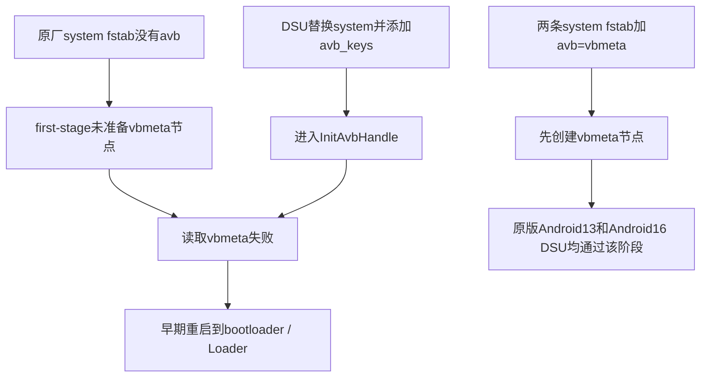

# 从拿到板子到 Android16 桌面：完整排障记录

本记录回看了本项目从初次上电、ADB连接、编译环境，到DSU、原版回归、码率修复和功能/性能测试的整个会话。时间线使用Asia/Singapore；阶段中保留已证实结论、曾经的错误判断及后来修正，不照搬原始聊天、日志或私人标识。

## 先判断失败发生在哪一层

| 层级 | 要看的证据 | 本次遇到的问题 |
|---|---|---|
| 供电/介质/显示 | 电源规格、LED、TF优先级、UART输出 | 初次停在Rockchip kernel画面，后续进入原厂Android13；没有证据证明当时是内核故障 |
| USB枚举 | 主机USB树、板端UDC/extcon、连接角色 | C→C下未建立数据枚举，USB gadget/PHY有错误 |
| 主机访问权限 | 枚举是否已存在、device node权限、libusb错误 | 无seat的SSH用户没有USB权限，ADB daemon启动失败 |
| 构建与包检查 | repo同步、构建退出码、VINTF、文件系统/AVB/哈希 | repo launcher提示、sandbox warning、旧HAL声明缺口 |
| first-stage启动 | pstore、USB Loader转换、fstab/实际init行为 | DSU需要的vbmeta节点未准备，约4.18秒进bootloader |
| Android核心服务 | API、system_server重启数、native崩溃栈 | AVC High10 Level6.2 int32码率溢出 |
| 外设/应用 | 实际操作与采样，不仅服务名 | 蓝牙节点权限、传感器、RIL、GPU-work统计、刷新率与codec能力声明 |

无线ADB能用但USB没枚举，不是“ADB坏了”；image编译成功但first-stage失败，不是“再等一下就好”；system_server稳定但vendor服务崩溃，也不能称完整移植完成。

## 1. 初次卡在 Rockchip kernel，POWER 绿灯亮

**现象**：新板上电，显示Rockchip kernel；POWER绿灯亮。

**判断边界**：绿灯说明有供电，不证明电压/电流足够或Android已启动。这个阶段没有UART启动捕获，因此不能事后把初次画面停留认定为kernel panic。

**排查方法**：核对DC12V、至少1.5A；观察蓝色运行灯；移除TF和非必要外设做对照；天线金属部分不要压在板上。TF优先于eMMC，初次等待可作为排除条件，但确认反复重启后继续等待没有诊断价值。[厂商快速使用](https://doc.kickpi.com/products/beginner_guide/kickpi_k11c/)及[卡Logo问题](https://doc.kickpi.com/products/question/system/)。

**本次结果**：后续成功进入原厂Android13。初次停留的具体原因没有验证，不补写“已修复某个硬件问题”。

**UART准备**：K11C的30针排针DEBUG使用29:GND、27:TX、25:RX，USB-TTL与TX/RX交叉连接，VCC不接，板子仍用DC供电，1500000 baud。针脚方向以官方图为准，不能仅凭线序猜测。[Serial Debug](https://doc.kickpi.com/products/beginner_guide/kickpi_k11c/#serial-debug)。本会话提供了接线说明，但没有把不存在的UART实测写成证据。

## 2. 开发者模式与无线ADB正常，不等于USB正常

设置→关于设备→版本号点7次→开发者选项→USB调试。无线调试使用临时配对端点与配对码；配对端口和实际连接端口可能不同。[Android调试说明](https://developer.android.com/studio/debug/dev-options)。

本次无线配对后shell验证原厂Android13/API33。adb devices里的_adb-tls-connect._tcp表示无线传输，不能把“出现device”直接当成USB已连接。USB的adb devices -l通常会带usb拓扑字段，需与USB设备树同时核对。

配对时曾有ADB本机listener的Operation not permitted，属于执行环境权限限制；在正确权限环境重试后成功。配对码及设备标识不写入本仓库。

## 3. C→C未枚举、DCP=1、ep0out错误

**观察**：主机未出现Rockchip设备；板端USB=0、DISCONNECTED/not attached；内核出现failed to enable ep0out，UDC绑定Device or resource busy、已有symlink等错误。换线后DCP从0变1，但数据连接仍没建立。

**定位**：问题发生在USB控制器/PHY/角色或线缆协商层，早于ADB授权。DCP是充电口识别结果，但Rockchip检测超时也可能进入这个状态，因此不把DCP=1等同于“必然是充电专用线”。[Rockchip USB2 PHY源码](https://github.com/rockchip-linux/kernel/blob/develop-5.10/drivers/phy/rockchip/phy-rockchip-inno-usb2.c)。

**对照与修正**：

- 最早看见的扩展坞属于另一连接；用户说明C→C直连后，重新采集当前拓扑，不能沿用扩展坞结论。
- 主机USB历史失败计数没有在短时采样中增长，不能把累计次数都归到这块板。
- 板端device角色和PHY Host/供电标记曾不稳定；临时固定peripheral约15秒仍未枚举，恢复otg，没有持久修改。
- Linux USB-A主机第一次快照没看见板子，后续内核日志却记录K11C已成功枚举；同线另一台Android设备也以480Mbps枚举，证明该线和主机口有数据能力。更新先前“主机完全没识别到”的判断。

**结果与边界**：后续K11C使用USB-A主机直连，可进行USB ADB与安装/截图。仍未通过单一控制变量证明C→C失败究竟是线、Type-C识别、具体固件/PHY还是硬件；没有宣布Mac接口或板子接口损坏。

方便复查的命令：主机lsusb、ADB列表，macOS的system_profiler SPUSBDataType / ioreg USB树，板端dumpsys usb、UDC/extcon状态和dmesg。保留DC供电，确认使用板子的Type-C OTG数据口，Type-A板口用于外设。

## 4. ADB server didn't ACK / libusb Access denied

**现象**：USB已枚举，但adb devices显示no permissions；启动daemon报failed to open device: Access denied (insufficient permissions)，随后server didn't ACK。

**原因**：USB device node访问权限不足。主机通过SSH操作，没有本地seat；仅有uaccess标签并不保证远程用户得到ACL。这与Android16、GSI、线缆是否有数据能力是不同问题。

**本次处理**：先临时修正当前节点访问以验证，再持久配置只匹配ADB接口的udev规则。初始OWNER普通用户方案遇到udev弃用警告，改为OWNER=root、已有管理员组、0660。NixOS示例与本次最终规则一致：

```nix
services.udev.extraRules = ''
  SUBSYSTEM=="usb", ENV{DEVTYPE}=="usb_device", ENV{ID_USB_INTERFACES}=="*:ff4201:*", OWNER="root", GROUP="wheel", MODE="0660"
'';
```

wheel是该环境的既有管理员组，换环境应确认操作者组成员资格，或采用合适的专用ADB组；不要改成全USB 0666或让ADB永远以root运行。[NixOS Android说明](https://wiki.nixos.org/wiki/Android)。

先构建/dry-activate确认配置变更范围，再激活，reload/trigger/settle udev规则，重启普通用户ADB daemon。本次shell验证USB_ADB_OK，持久规则生效。激活另外报告已有Samba服务启动失败，单独记录，没有为ADB修改Samba配置，也不把独立失败当成USB权限修复失败。

## 5. 构建虚拟机、CPU绑定与无关环境错误

Linux构建guest为Ubuntu24.04，24vCPU、40GiB RAM、32GiB swap，源码与输出有充足独立空间。旧SOCKS代理服务未启动，但Google/GitHub直连验证正常，构建没有依赖失败代理。

CPU绑定按物理拓扑选择完整12核心及其24个SMT线程，宿主预留4物理核；QEMU emulator放在预留核心，live与persistent绑定一致。检查宿主lscpu拓扑与virsh vcpupin结果，不能只凭guest显示24CPU就说绑定完成。编译用-j12控制内存峰值。

具体主机CPU编号、域名、SSH配置和VM XML不公开；不同CPU拓扑应重新计算，不照抄某台机器的编号。

## 6. repo新版本提示、同步时间估算与nsjail

**repo提示**：launcher从/usr/bin/repo执行且不可写，内部checkout发现较新launcher。该提示不是同步失败；原正在进行的同步无需因提示重跑。本次更新launcher为2.65并验证新命令来源，内部repo版本与launcher版本分别显示。

通用操作应先确认文件来源和预期版本，不直接覆盖发行版管理的/usr/bin：

```bash
command -v repo
repo version
# 审核当前checkout的launcher后安装到系统允许的位置。
sudo install -m 0755 .repo/repo/repo /usr/local/bin/repo
hash -r
command -v repo
repo version
```

下载估算曾依据约9.6MB/s、剩余Clang/Rust大仓库粗算；repo项目个数不是字节进度，下载结束也不等于展开/编译结束。实际首次完整构建约1:49:04，应保留实际结果而不是把当时预测当成保证。

**nsjail**：构建输出Build sandboxing disabled due to nsjail error，但最终build completed successfully。这反映构建进程隔离功能未启用；本次未完成其独立根因分析。不能拿这条warning解释板上first-stage失败，也不能称构建隔离已正常。

## 7. 编译成功后仍有VINTF差异

factory vendor声明radio1.5 slot1/slot2，以及Rockchip neuralnetworks、outputmanager、rockit等旧HAL，初始framework矩阵没有匹配这些声明。

新增system_ext-specific的k11c_framework_compatibility_matrix，将这些HAL写为optional，并同时加入aosp_arm64产品包与GSI android_system_image deps；仅定义模块而没有让GSI打包依赖它是不完整的适配。实际输出镜像与factory vendor/kernel静态VINTF检查通过。

这处理的是声明覆盖，不是radio、NPU或Rockit功能验收。optional矩阵不能修复HAL崩溃。仓库保存实际overlay与build/make补丁，见 [build](android16/build.md)。

## 8. DSU约4.18秒进Loader：不能继续盲等

DSU安装结束、临时分区名字出现，不代表新Android启动。失败日志显示first-stage约2.77秒Failed to read vbmeta partitions，约4.18秒reboot bootloader，USB变成Rockchip Loader。一次单纯等待只能确认它没有继续完成启动，随后要转为日志与启动阶段定位。

原厂boot/vbmeta/fstab与原始init实际二进制分析形成因果链：fstab无avb标记→first-stage不请求vbmeta节点→DSU加avb_keys后又调用InitAvbHandle→缺少必须节点。



factory vbmeta有效、flags=2，未证明GSI密钥被拒绝；“已关闭验证”也不代表DSU完全不需要vbmeta节点。修复是准备节点，不是随意禁用更多安全机制。初始没有完整syscall errno，所以静态机制与后来板上修复验证分别记录。

只对两条system fstab加avb=vbmeta，离线检查基线重打包、组件字节一致、候选大小、hash；没有改kernel/DTB、super、vendor、vbmeta或原厂userdata。boot是持久分区，DSU是临时单次启动，授权与恢复边界不同。

**最关键的回归顺序**：修改boot后先启动原版Android13，约30秒boot complete、桌面和USBADB正常，再测试Android16。仅能启动新系统不等于原版仍可恢复。

第一次Android16进入API36后又遇到另一问题；测试间恢复原厂boot/Android13，保留失败证据；新候选检查完毕后才安装、清除旧DSU测试userdata并重新启用单次DSU。清理的不是原厂Android13 userdata。

## 9. system_server崩溃：AVC算术溢出，与AVB分开处理

越过first-stage后system_server反复中止，libmedia_codeclist_capabilities.so报signed integer overflow。High10 Level6.2的800000×3000超出int32；ARM64CPU也不会让局部int32变量自动变宽。

独立native测试不调用Rockchip驱动即可在32/64位复现，因此是通用算术缺陷，K11C能力枚举路径触发了它；本会话未进一步确定到底哪一个codec提供该组合，不声称所有Android16设备都一定失败。

修正AVC BR中间值为int64，公共int32范围写入时clamp；保留UBSan/CFI，新增四个边界测试。实际构建目标：

```bash
source build/envsetup.sh
lunch aosp_arm64-bp4a-userdebug
m -j12 libmedia_codeclist_capabilities CodecCapabilitiesTest systemimage
```

生成data/nativetest64/CodecCapabilitiesTest/CodecCapabilitiesTest及data/nativetest/CodecCapabilitiesTest/CodecCapabilitiesTest。完整板上回归两架构共50项通过。重构建后的镜像再做VINTF/文件系统/AVB/解压和读回hash检查，Android16约90秒boot complete，system_server启动数保持1。

## 10. 黑截图与自动熄屏，不是渲染失败

初次成功启动的截图是黑色，但power状态为Asleep、自动熄屏原为60秒。唤醒后Settings/Display可见；临时stayon诊断完一度恢复原值，后续用户要求关闭自动熄屏才持久设置：

```bash
adb -s "$ANDROID_SERIAL" shell settings put system screen_off_timeout 2147483647
adb -s "$ANDROID_SERIAL" shell svc power stayon true
```

接电常亮的setting在该系统为15；超时最大值本身约24.9天，不是数学意义上的永不超时。power键仍可主动熄屏。input keyevent26是切换，操作前后读状态，不盲发两次后凭空说已亮。

本次三轮Awake→Asleep→Awake通过，core和联网保持。唤醒进入无密码锁屏后，单纯am start或wm dismiss-keyguard没有让Settings真正可见；菜单键82后才解除。截图和窗口状态验证实际前台，再采集UI性能，避免把锁屏当成设置页面。

## 11. 外设与性能测试中新发现的问题

| 现象 | 本次处理/结果 | 仍需注意 |
|---|---|---|
| 蓝牙HAL无法open节点 | /dev/BTBOOT等root:root 0600，改bluetooth:bluetooth 0660后ON；实际BLE收到921包/29个设备 | 临时/dev权限，重启丢失；规则片段尚未固化进镜像 |
| DNS首轮UnknownHostException | 后续两轮实际应用DNS/HTTPS200成功；没有改变网络配置来声称“已修根因” | 保留首次失败，继续长测 |
| AudioTrack最初报告未初始化 | 测试工具在MODE_STATIC写入前就断言STATE_INITIALIZED，检查顺序错误；改成先写数据再检查 | 修正后48000帧正常推进，不能把测试bug当HAL故障 |
| 传感器枚举但注册PERMISSION_DENIED | 应用与系统客户端均失败 | 未证明实际有效传感器可用，保留待修 |
| rild与gpuservice循环中止 | 实际RIL_Init与GpuWork::initialize崩溃证据仍存在 | 不影响本次核心稳定证据，但增加未完成兼容工作；图形渲染测试本身通过 |
| 默认只有约31FPS | 物理62Hz而renderRate31；临时min/peak62后61.99FPS，满CPU61.85FPS | 临时设置已恢复，不把短时动画当游戏或呈现认证 |
| 1080p60能力查询不支持 | 实际指定c2.rk.avc.decoder后180帧解完 | 自动选择codec可能走软件，能力声明仍需修正 |
| 1080p60 YUV路径只有约19.5fps | 分离Surface路径，同样180帧1.65秒约109fps解码吞吐 | YUV拷贝不能代表正常显示路径；吞吐不等于屏幕fps/音画同步验收 |

全部指标和方法见 [test-report](android16/test-report.md)。摄像头数为0、无以太网/SD/USB-host附件，保持未测。音频API成功不等于人耳确认音质。核心在约35分钟观察中未重启，不是24小时或CTS/VTS认证。

后续继续排查已定位DNS冷启动UID策略竞争、传感器缺失设备与错误码误传，并核对Type-C OTG的USB2.0边界，见 [后续记录](android16/followup-usb-dns-sensors.md)。以上表格保留前一阶段的观察，不能只引用它忽略后来证据。

## 12. 上游查重、版本路线与最终边界

AOSP已有同类Gerrit，维护者备注内部合入，见 [upstream](upstream.md)。内部合入不等于目标公开分支已包含；不向GitHub镜像提交重复PR。新增测试与独立复现证据可用于后续贡献，但尚未发布上游反馈。

Android17仍未构建/启动。本项目first API33、保留旧vendor/kernel的GSI实验，和新设备出厂认证的kernel要求不同；也不能忽略ACK支持周期与新userspace需要的kernel/BPF/接口功能。查看[ACK兼容表](https://source.android.com/docs/core/architecture/kernel/android-common#compatibility-matrix)，结合具体目标版本验证，不能只用CPU是ARM64判断全部可用。

最终设备保持Android16单次DSU、接电常亮、蓝牙临时权限修复；下次正常重启回Android13，持久boot补丁仍在。测试APK和压力进程清理，临时刷新率设置恢复。原始captures与可恢复固件留在私有存储，公开仓库只保存脱敏方法和结论。
